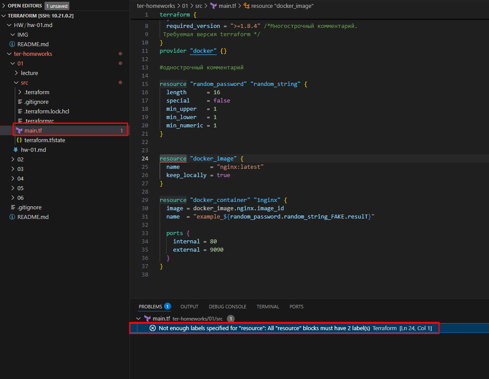
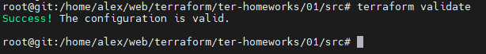

# Домашнее задание к занятию «Введение в Terraform» - Храмов Александр Николаевич

## Задание 1


1 Перейдите в каталог src. Скачайте все необходимые зависимости, использованные в проекте.

- Ответ:
```
Проверка версии terraform:


 

 Скачал SCR:

 

   

```

2 Изучите файл .gitignore. В каком terraform-файле, согласно этому .gitignore, допустимо сохранить личную, секретную информацию?(логины,пароли,ключи,токены итд)

- Ответ:
```


Cогласно этому .gitignore, сохраняет (логины,пароли,ключи,токены итд) в файде : personal.auto.tfvars
```

3 Выполните код проекта. Найдите в state-файле секретное содержимое созданного ресурса random_password, пришлите в качестве ответа конкретный ключ и его значение.

- Ответ:
```
После выполнения получаем секретное значение random_password, оно лежит в файлике terraform.tfstate: "result": "LF13AaA0qRoy6OAw", 


```

4 Раскомментируйте блок кода, примерно расположенный на строчках 29–42 файла main.tf. Выполните команду terraform validate. Объясните, в чём заключаются намеренно допущенные ошибки. Исправьте их.

- Ответ:
```
После ввода команды terraform validate выдал ошибку:


VSC подсказывал ндн ошибки:
на 24 строке нужно было дописать название resource "docker_image" "nginx"
29 строка нужно было убрать 1 с названия resource "docker_container" "nginx"
31 строка не не првильно указаны ресурсы и присутствовали большие буквы name  = "example_${random_password.random_string.result}"



Исправления 




```

5 Выполните код. В качестве ответа приложите: исправленный фрагмент кода и вывод команды docker ps.

- Ответ:
```


```

6 Замените имя docker-контейнера в блоке кода на hello_world. Не перепутайте имя контейнера и имя образа. Мы всё ещё продолжаем использовать name = "nginx:latest". Выполните команду terraform apply -auto-approve. Объясните своими словами, в чём может быть опасность применения ключа -auto-approve. Догадайтесь или нагуглите зачем может пригодиться данный ключ? В качестве ответа дополнительно приложите вывод команды docker ps.

- Ответ:
```
После изменения имени и ввода команды"terraform apply -auto-approve" мы видим что изменилось имя контейнера. 

Опасность заключается в том что команда "terraform apply -auto-approve" не контролируется и принемает все изменения без возможности отмены. 

Случаи, когда может быть полезен флаг -auto-approve: CI/CD пайплайны, автоматическое восстановление после сбоев, тестирование.


```

7 Уничтожьте созданные ресурсы с помощью terraform. Убедитесь, что все ресурсы удалены. Приложите содержимое файла terraform.tfstate.

- Ответ:
```
Уничтожил при помощи команды "terraform destroy"


```

8 Объясните, почему при этом не был удалён docker-образ nginx:latest. Ответ ОБЯЗАТЕЛЬНО НАЙДИТЕ В ПРЕДОСТАВЛЕННОМ КОДЕ, а затем ОБЯЗАТЕЛЬНО ПОДКРЕПИТЕ строчкой из документации terraform провайдера docker. (ищите в классификаторе resource docker_image )

- Ответ:
```
Докер контейнер nginx:lates не был удален, потому что ипользовали параметр keep_locally = true при создании imag


```
